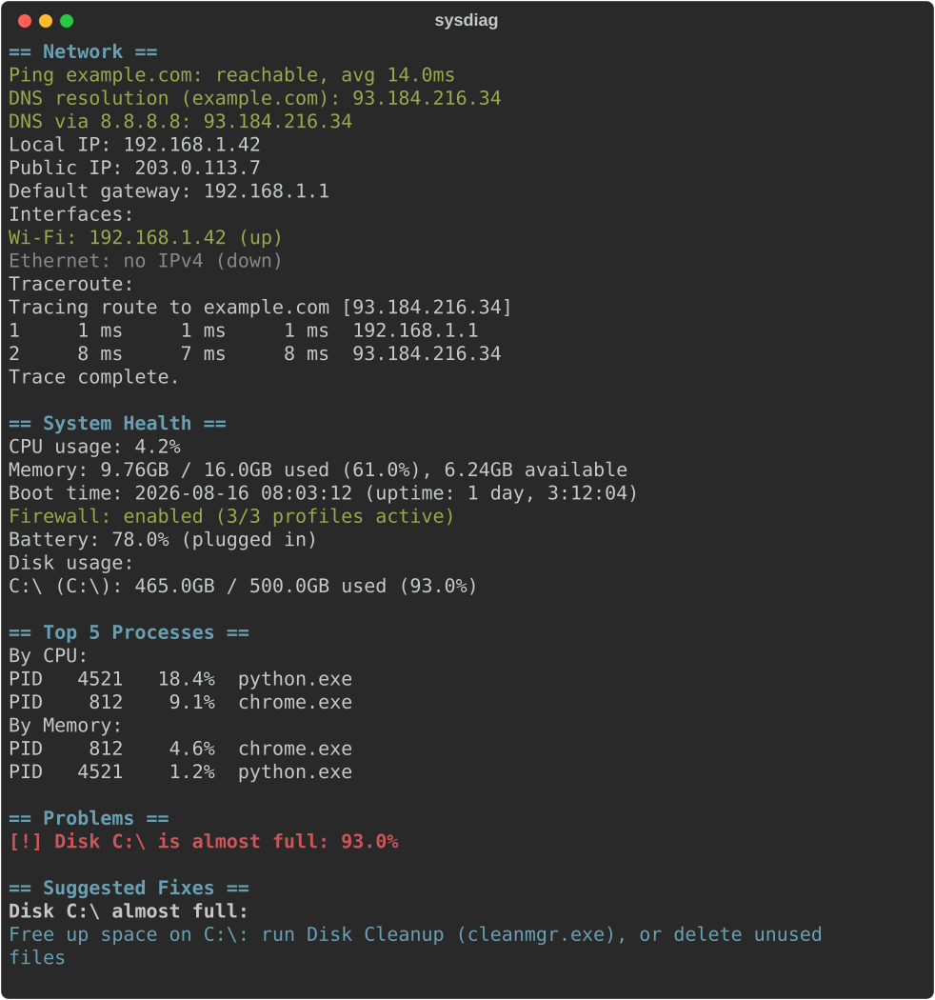

# sysdiag

[](https://github.com/RobertOprr/sysdiag/actions/workflows/tests.yml)
[](LICENSE)
[](pyproject.toml)

A command-line IT diagnostics tool that runs the classic L1 help-desk checks :
connectivity, DNS, system health, and top processes : and prints a clear report.
Cross-platform: works the same on Windows and Linux.



## What it checks

- **Network**: ping reachability + average latency, DNS resolution (both via
  the system resolver and directly against a public resolver, to tell "the
  internet is down" apart from "your DNS resolver is broken"), local IP,
  public/WAN IP, default gateway, network interfaces (up/down + IP per NIC),
  traceroute hop list
- **System health**: disk usage per drive/partition, memory usage, CPU usage,
  boot time / uptime, battery (if present), firewall status (Windows Defender
  Firewall profiles / `ufw` on Linux)
- **Processes**: top N processes by CPU and by memory
- **Ports** (opt-in, `--ports`): TCP connect check against a small list of
  common ports (ssh, dns, http, https, rdp) or a custom list
- **Recent System Errors** (opt-in, `--events`): last N Error/Critical events
  from the Windows Event Log (`wevtutil`) or `journalctl -p err` on Linux
- **Problems**: flags disk/memory usage over 90% (configurable), failed ping,
  failed DNS, a disabled firewall, or recent system errors. Exit code is `1`
  if any problems were found, `0` otherwise : safe to use in cron/CI/monitoring.
- **Suggested Fixes**: for each flagged problem, a plain-English fix : OS-aware
  (`ipconfig /flushdns` vs `resolvectl flush-caches`) and, for high memory,
  personalized with the actual top memory-consuming process from the same run.
  **Suggest-only** : sysdiag never executes anything itself; it always tells
  you, you always decide.

Report output is colorized with `rich` (green = healthy, red = flagged) when
run in a real terminal; colors are automatically suppressed when output is
piped or captured (e.g. in tests, or `> file.txt`).

## Install

```bash
pip install -e .          # installs sysdiag as a package + puts a `sysdiag` command on your PATH
pip install -e ".[dev]"   # also pulls in pytest, pytest-cov, mypy for development
```

Once installed, `sysdiag` works the same as `python sysdiag.py` in every example below.

## Usage

```bash
# run every check
python sysdiag.py

# run just one group
python sysdiag.py --network
python sysdiag.py --system
python sysdiag.py --processes

# target a different host for ping/DNS/traceroute
python sysdiag.py --network --host example.com

# show more processes
python sysdiag.py --processes --top 10

# machine-readable output
python sysdiag.py --json

# only show flagged problems (good for cron/monitoring)
python sysdiag.py --quiet

# custom problem thresholds
python sysdiag.py --disk-threshold 80 --mem-threshold 75

# check whether common ports are open on a host (opt-in, not part of the default run)
python sysdiag.py --ports --host example.com
python sysdiag.py --ports --host example.com --port-list 80,443,8443

# check for recent system errors (opt-in, not part of the default run)
python sysdiag.py --events
python sysdiag.py --events --event-count 10

# also save the report to a file (format inferred from the extension)
python sysdiag.py --output report.txt
python sysdiag.py --json --output report.json
python sysdiag.py --output report.html    # self-contained, colored HTML
```

## Sample output

Matches the screenshot above (see `scripts/generate_demo_svg.py` for the fixed
sample data : never the machine's real IP/gateway):

```
== Network ==
Ping example.com: reachable, avg 14.0ms
DNS resolution (example.com): 93.184.216.34
DNS via 8.8.8.8: 93.184.216.34
Local IP: 192.168.1.42
Public IP: 203.0.113.7
Default gateway: 192.168.1.1
Interfaces:
  Wi-Fi: 192.168.1.42 (up)
  Ethernet: no IPv4 (down)
Traceroute:
  Tracing route to example.com [93.184.216.34]
    1     1 ms     1 ms     1 ms  192.168.1.1
    2     8 ms     7 ms     8 ms  93.184.216.34
  Trace complete.

== System Health ==
CPU usage: 4.2%
Memory: 9.76GB / 16.0GB used (61.0%), 6.24GB available
Boot time: 2026-08-16 08:03:12 (uptime: 1 day, 3:12:04)
Firewall: enabled (3/3 profiles active)
Battery: 78.0% (plugged in)
Disk usage:
  C:\ (C:\): 465.0GB / 500.0GB used (93.0%)

== Top 5 Processes ==
By CPU:
  PID   4521   18.4%  python.exe
  PID    812    9.1%  chrome.exe
By Memory:
  PID    812    4.6%  chrome.exe
  PID   4521    1.2%  python.exe

== Problems ==
  [!] Disk C:\ is almost full: 93.0%

== Suggested Fixes ==
  Disk C:\ almost full:
    Free up space on C:\: run Disk Cleanup (cleanmgr.exe), or delete unused files
```

## Testing

```bash
pytest --cov=sysdiag --cov-report=term-missing
mypy sysdiag.py
```

**78 tests, 86% coverage.** Tests cover the pure-logic parts (threshold
flagging, fix suggestions, report formatting, ping-output parsing, gateway
parsing, port-list parsing, resolver-targeted DNS, event-log parsing, firewall
status parsing, JSON output shape, exit codes, `--output` file writing in all
three formats) with system calls mocked out : they don't depend on the machine
they run on. The untested ~14% is thin OS-call wrappers (the actual
psutil/ping/traceroute invocations) : deliberately out of scope per the "mock
system calls, test logic" testing philosophy above, rather than a coverage gap.

The codebase is fully type-hinted and passes `mypy` in strict mode. CI
(`.github/workflows/tests.yml`) runs tests + coverage + mypy on both Ubuntu and
Windows on every push.

## Building a standalone executable

For handing to a machine without Python installed (e.g. a helpdesk laptop):

```bash
pip install pyinstaller
pyinstaller --onefile --name sysdiag sysdiag.py
# -> dist/sysdiag.exe (Windows) or dist/sysdiag (Linux), no Python required to run it
```

## Project structure

- `sysdiag.py` : the CLI
- `test_sysdiag.py` : pytest unit tests
- `pyproject.toml` : packaging (installable via `pip install -e .`, exposes
  the `sysdiag` command), dependencies, mypy config
- `requirements.txt` : convenience wrapper around `pip install -e .[dev]`
- `LICENSE` : MIT
- `CHANGELOG.md` : release notes ([Keep a Changelog](https://keepachangelog.com/en/1.1.0/) format)
- `.github/workflows/tests.yml` : CI (pytest + coverage + mypy, Ubuntu + Windows)
- `assets/demo.svg` : the screenshot above, generated from fixed sample data
  (never the machine's real IP/gateway) via `python scripts/generate_demo_svg.py`
